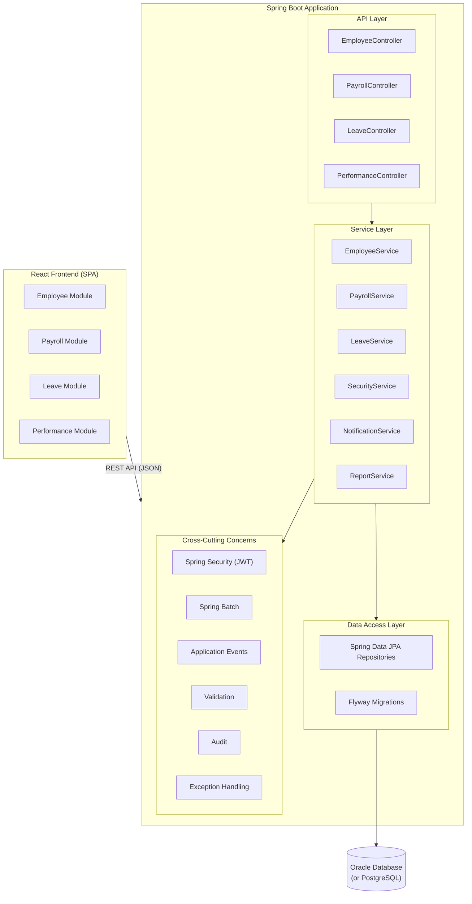
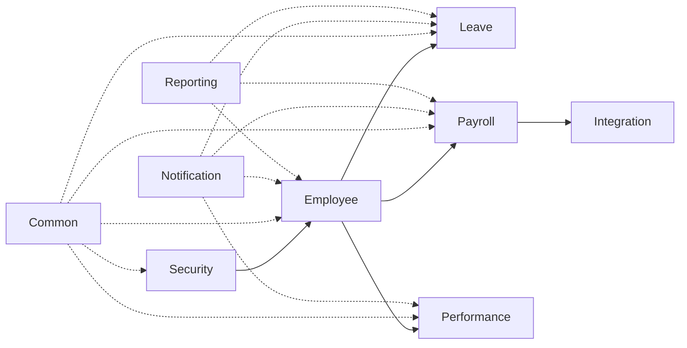

# Target Architecture Overview

## Architecture Style: Modular Monolith

The modernized HRMS uses a modular monolith architecture — a single deployable application with clear module boundaries enforced by Java packages and interfaces. This provides the organizational benefits of microservices (independent module development, clear contracts) without the operational complexity.

## High-Level Architecture



<details>
<summary>Text version (non-Mermaid fallback)</summary>

```
┌─────────────────────────────────────────────────────────┐
│                    React Frontend (SPA)                   │
│  ┌──────────┐ ┌──────────┐ ┌──────────┐ ┌────────────┐ │
│  │ Employee  │ │ Payroll  │ │  Leave   │ │ Performance│ │
│  │  Module   │ │  Module  │ │  Module  │ │   Module   │ │
│  └──────────┘ └──────────┘ └──────────┘ └────────────┘ │
└────────────────────────┬────────────────────────────────┘
                         │ REST API (JSON)
┌────────────────────────┴────────────────────────────────┐
│              Spring Boot Application                     │
│                                                          │
│  ┌─────────────────────────────────────────────────────┐ │
│  │                  API Layer                           │ │
│  │  EmployeeController  PayrollController  LeaveCtrl   │ │
│  └──────────────────────┬──────────────────────────────┘ │
│                         │                                │
│  ┌──────────────────────┴──────────────────────────────┐ │
│  │                Service Layer                         │ │
│  │  EmployeeService  PayrollService  LeaveService      │ │
│  │  SecurityService  NotificationService  ReportSvc    │ │
│  └──────────────────────┬──────────────────────────────┘ │
│                         │                                │
│  ┌──────────────────────┴──────────────────────────────┐ │
│  │              Data Access Layer                       │ │
│  │  Spring Data JPA Repositories                       │ │
│  │  Flyway Migrations                                  │ │
│  └──────────────────────┬──────────────────────────────┘ │
│                         │                                │
│  ┌──────────────────────┴──────────────────────────────┐ │
│  │           Cross-Cutting Concerns                     │ │
│  │  Spring Security (JWT)  Spring Batch  Events        │ │
│  │  Validation  Audit  Exception Handling              │ │
│  └─────────────────────────────────────────────────────┘ │
└────────────────────────┬────────────────────────────────┘
                         │
              ┌──────────┴──────────┐
              │   Oracle Database   │
              │   (or PostgreSQL)   │
              └─────────────────────┘
```

</details>

## Module Dependencies



> **Note**: The circular dependency between PKG_EMPLOYEE and PKG_PAYROLL in the legacy system
> is broken by using Spring Application Events. `EmployeeService` publishes events;
> `PayrollService` subscribes to them. See [dependency-map.md](dependency-map.md) for detailed Mermaid diagrams.

## Related Documentation

| Document | Description |
|---|---|
| [Application Inventory](application-inventory.md) | Complete catalog of all legacy system components |
| [Data Dictionary](data-dictionary.md) | All tables, columns, types, constraints, and ER diagram |
| [Dependency Map](dependency-map.md) | Mermaid diagrams for all dependency flows |
| [Hotspot Report](hotspot-report.md) | Complexity, risk, and technical debt analysis per program |
| [Assessment Report](../migration-plan/assessment-report.md) | Technical debt catalog (TD-001 through TD-027) |

## Technology Stack

| Layer | Technology | Replaces |
|---|---|---|
| Frontend | React 18 + TypeScript | Oracle Forms UI (.fmb) |
| API | Spring Boot 3 + Spring MVC | Forms → PL/SQL calls |
| Security | Spring Security + JWT | PKG_SECURITY + Forms session |
| Data | Spring Data JPA + Flyway | Direct SQL + PL/SQL packages |
| Batch | Spring Batch | DBMS_SCHEDULER + cursor loops |
| Integration | Spring Integration | UTL_FILE + flat files |
| Testing | JUnit 5 + Testcontainers | Manual testing only |
| Build | Maven + GitHub Actions | Manual deployment |
