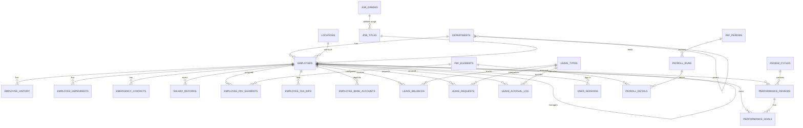

# Data Dictionary — Oracle Forms HRMS

> **Database**: Oracle 19c · **Schema**: HRMS
> **Source repo**: `ts-plsql-oracle-forms-legacy-codebase/schema/`

---

## Table of Contents

1. [Core Domain](#1-core-domain)
2. [Payroll Domain](#2-payroll-domain)
3. [Leave Management Domain](#3-leave-management-domain)
4. [Performance Management Domain](#4-performance-management-domain)
5. [System / Cross-Cutting](#5-system--cross-cutting)
6. [Views](#6-views)
7. [Sequences](#7-sequences)
8. [Entity-Relationship Diagram](#8-entity-relationship-diagram)

---

## 1. Core Domain

### DEPARTMENTS

> Organization departments and cost centers.

| Column | Type | Nullable | Default | Constraint | Description |
|---|---|---|---|---|---|
| DEPT_ID | NUMBER(10) | NOT NULL | — | PK | Surrogate key |
| DEPT_CODE | VARCHAR2(20) | NOT NULL | — | UNIQUE | Human-readable code |
| DEPT_NAME | VARCHAR2(100) | NOT NULL | — | — | Display name |
| PARENT_DEPT_ID | NUMBER(10) | NULL | — | Self-ref FK | Department hierarchy |
| COST_CENTER | VARCHAR2(20) | NULL | — | — | GL cost center code |
| MANAGER_EMP_ID | NUMBER(10) | NULL | — | — | Department head |
| LOCATION_CODE | VARCHAR2(10) | NULL | — | — | Primary location |
| ACTIVE_FLAG | CHAR(1) | NOT NULL | 'Y' | CHECK (Y/N) | Soft delete |
| CREATED_BY | VARCHAR2(30) | NOT NULL | — | — | Audit |
| CREATED_DATE | DATE | NOT NULL | SYSDATE | — | Audit |
| MODIFIED_BY | VARCHAR2(30) | NULL | — | — | Audit |
| MODIFIED_DATE | DATE | NULL | — | — | Audit |

---

### LOCATIONS

| Column | Type | Nullable | Default | Constraint | Description |
|---|---|---|---|---|---|
| LOCATION_CODE | VARCHAR2(10) | NOT NULL | — | PK | Natural key |
| LOCATION_NAME | VARCHAR2(100) | NOT NULL | — | — | Display name |
| ADDRESS_LINE1 | VARCHAR2(200) | NULL | — | — | Street address |
| ADDRESS_LINE2 | VARCHAR2(200) | NULL | — | — | Suite / floor |
| CITY | VARCHAR2(100) | NULL | — | — | City |
| STATE_PROVINCE | VARCHAR2(100) | NULL | — | — | State or province |
| POSTAL_CODE | VARCHAR2(20) | NULL | — | — | ZIP / postal code |
| COUNTRY_CODE | VARCHAR2(3) | NULL | — | — | ISO 3166 alpha-3 |
| PHONE_NUMBER | VARCHAR2(30) | NULL | — | — | Office phone |
| TIMEZONE | VARCHAR2(50) | NULL | 'America/New_York' | — | IANA timezone |
| ACTIVE_FLAG | CHAR(1) | NOT NULL | 'Y' | — | Soft delete |
| CREATED_BY | VARCHAR2(30) | NOT NULL | — | — | Audit |
| CREATED_DATE | DATE | NOT NULL | SYSDATE | — | Audit |
| MODIFIED_BY | VARCHAR2(30) | NULL | — | — | Audit |
| MODIFIED_DATE | DATE | NULL | — | — | Audit |

---

### JOB_GRADES

| Column | Type | Nullable | Default | Constraint | Description |
|---|---|---|---|---|---|
| GRADE_ID | NUMBER(5) | NOT NULL | — | PK | Surrogate key |
| GRADE_CODE | VARCHAR2(10) | NOT NULL | — | UNIQUE | Grade identifier |
| GRADE_NAME | VARCHAR2(50) | NOT NULL | — | — | Display name |
| MIN_SALARY | NUMBER(12,2) | NOT NULL | — | — | Grade floor |
| MAX_SALARY | NUMBER(12,2) | NOT NULL | — | CHECK (MAX >= MIN) | Grade ceiling |
| OVERTIME_ELIGIBLE | CHAR(1) | NULL | 'N' | — | FLSA flag |
| ACTIVE_FLAG | CHAR(1) | NOT NULL | 'Y' | — | Soft delete |
| CREATED_BY | VARCHAR2(30) | NOT NULL | — | — | Audit |
| CREATED_DATE | DATE | NOT NULL | SYSDATE | — | Audit |
| MODIFIED_BY | VARCHAR2(30) | NULL | — | — | Audit |
| MODIFIED_DATE | DATE | NULL | — | — | Audit |

---

### JOB_TITLES

| Column | Type | Nullable | Default | Constraint | Description |
|---|---|---|---|---|---|
| JOB_ID | NUMBER(10) | NOT NULL | — | PK | Surrogate key |
| JOB_CODE | VARCHAR2(20) | NOT NULL | — | UNIQUE | Job identifier |
| JOB_TITLE | VARCHAR2(100) | NOT NULL | — | — | Display title |
| JOB_FAMILY | VARCHAR2(50) | NULL | — | — | Grouping |
| GRADE_ID | NUMBER(5) | NOT NULL | — | FK → JOB_GRADES | Compensation grade |
| EEO_CATEGORY | VARCHAR2(10) | NULL | — | — | EEO-1 code |
| FLSA_STATUS | VARCHAR2(10) | NULL | 'EXEMPT' | — | Fair Labor Standards Act |
| ACTIVE_FLAG | CHAR(1) | NOT NULL | 'Y' | — | Soft delete |
| CREATED_BY | VARCHAR2(30) | NOT NULL | — | — | Audit |
| CREATED_DATE | DATE | NOT NULL | SYSDATE | — | Audit |
| MODIFIED_BY | VARCHAR2(30) | NULL | — | — | Audit |
| MODIFIED_DATE | DATE | NULL | — | — | Audit |

---

### EMPLOYEES

> Master employee records — core entity of the HRMS system.

| Column | Type | Nullable | Default | Constraint | Description |
|---|---|---|---|---|---|
| EMP_ID | NUMBER(10) | NOT NULL | — | PK | Surrogate key |
| EMP_NUMBER | VARCHAR2(20) | NOT NULL | — | UNIQUE | Business key (EMP-NNNNNN) |
| FIRST_NAME | VARCHAR2(50) | NOT NULL | — | — | Given name (stored UPPER) |
| MIDDLE_NAME | VARCHAR2(50) | NULL | — | — | Middle name |
| LAST_NAME | VARCHAR2(50) | NOT NULL | — | — | Surname (stored UPPER) |
| DATE_OF_BIRTH | DATE | NULL | — | — | DOB |
| GENDER | CHAR(1) | NULL | — | CHECK (M/F/O) | Gender code |
| MARITAL_STATUS | VARCHAR2(10) | NULL | — | — | Marital status |
| NATIONALITY | VARCHAR2(50) | NULL | — | — | Nationality |
| SSN_ENCRYPTED | VARCHAR2(200) | NULL | — | — | AES-256 encrypted SSN (PKG_SECURITY) |
| EMAIL | VARCHAR2(100) | NULL | — | — | Work email (login username) |
| PHONE_WORK | VARCHAR2(30) | NULL | — | — | Office phone |
| PHONE_MOBILE | VARCHAR2(30) | NULL | — | — | Mobile phone |
| ADDRESS_LINE1 | VARCHAR2(200) | NULL | — | — | Street address |
| ADDRESS_LINE2 | VARCHAR2(200) | NULL | — | — | Suite / apt |
| CITY | VARCHAR2(100) | NULL | — | — | City |
| STATE_PROVINCE | VARCHAR2(100) | NULL | — | — | State / province |
| POSTAL_CODE | VARCHAR2(20) | NULL | — | — | ZIP / postal |
| COUNTRY_CODE | VARCHAR2(3) | NULL | — | — | ISO 3166 |
| HIRE_DATE | DATE | NOT NULL | — | — | Original hire date |
| TERMINATION_DATE | DATE | NULL | — | — | Termination effective date |
| TERMINATION_REASON | VARCHAR2(50) | NULL | — | — | Reason code |
| DEPT_ID | NUMBER(10) | NOT NULL | — | FK → DEPARTMENTS | Current department |
| JOB_ID | NUMBER(10) | NOT NULL | — | FK → JOB_TITLES | Current job |
| MANAGER_EMP_ID | NUMBER(10) | NULL | — | FK → EMPLOYEES (self) | Direct manager |
| LOCATION_CODE | VARCHAR2(10) | NULL | — | FK → LOCATIONS | Work location |
| EMPLOYMENT_TYPE | VARCHAR2(20) | NULL | 'FULL_TIME' | CHECK | FULL_TIME, PART_TIME, CONTRACT, INTERN |
| EMPLOYMENT_STATUS | VARCHAR2(20) | NULL | 'ACTIVE' | CHECK | ACTIVE, ON_LEAVE, SUSPENDED, TERMINATED |
| PHOTO_BLOB | BLOB | NULL | — | — | Employee photo |
| NOTES | CLOB | NULL | — | — | Free-text notes |
| ACTIVE_FLAG | CHAR(1) | NOT NULL | 'Y' | — | Soft delete |
| CREATED_BY | VARCHAR2(30) | NOT NULL | — | — | Audit |
| CREATED_DATE | DATE | NOT NULL | SYSDATE | — | Audit |
| MODIFIED_BY | VARCHAR2(30) | NULL | — | — | Audit |
| MODIFIED_DATE | DATE | NULL | — | — | Audit |

---

### EMPLOYEE_HISTORY

| Column | Type | Nullable | Default | Constraint | Description |
|---|---|---|---|---|---|
| HIST_ID | NUMBER(15) | NOT NULL | — | PK | Surrogate key |
| EMP_ID | NUMBER(10) | NOT NULL | — | FK → EMPLOYEES | Subject employee |
| CHANGE_TYPE | VARCHAR2(30) | NOT NULL | — | CHECK | HIRE, TRANSFER, PROMOTION, DEMOTION, SALARY_CHANGE, TERMINATION, REHIRE, LEAVE_START, LEAVE_END, STATUS_CHANGE |
| EFFECTIVE_DATE | DATE | NOT NULL | — | — | When change takes effect |
| OLD_DEPT_ID | NUMBER(10) | NULL | — | — | Previous department |
| NEW_DEPT_ID | NUMBER(10) | NULL | — | — | New department |
| OLD_JOB_ID | NUMBER(10) | NULL | — | — | Previous job |
| NEW_JOB_ID | NUMBER(10) | NULL | — | — | New job |
| OLD_MANAGER_ID | NUMBER(10) | NULL | — | — | Previous manager |
| NEW_MANAGER_ID | NUMBER(10) | NULL | — | — | New manager |
| OLD_SALARY | NUMBER(12,2) | NULL | — | — | Previous salary |
| NEW_SALARY | NUMBER(12,2) | NULL | — | — | New salary |
| OLD_LOCATION | VARCHAR2(10) | NULL | — | — | Previous location |
| NEW_LOCATION | VARCHAR2(10) | NULL | — | — | New location |
| REASON_CODE | VARCHAR2(30) | NULL | — | — | Change reason |
| COMMENTS | VARCHAR2(4000) | NULL | — | — | Free-text notes |
| CREATED_BY | VARCHAR2(30) | NOT NULL | — | — | Audit |
| CREATED_DATE | DATE | NOT NULL | SYSDATE | — | Audit |

---

### EMPLOYEE_DEPENDENTS

| Column | Type | Nullable | Default | Constraint | Description |
|---|---|---|---|---|---|
| DEPENDENT_ID | NUMBER(10) | NOT NULL | — | PK | Surrogate key |
| EMP_ID | NUMBER(10) | NOT NULL | — | FK → EMPLOYEES | Parent employee |
| FIRST_NAME | VARCHAR2(50) | NOT NULL | — | — | Dependent first name |
| LAST_NAME | VARCHAR2(50) | NOT NULL | — | — | Dependent last name |
| RELATIONSHIP | VARCHAR2(20) | NOT NULL | — | CHECK | SPOUSE, CHILD, PARENT, DOMESTIC_PARTNER, OTHER |
| DATE_OF_BIRTH | DATE | NULL | — | — | DOB |
| SSN_ENCRYPTED | VARCHAR2(200) | NULL | — | — | AES-256 encrypted SSN |
| BENEFITS_ENROLLED | CHAR(1) | NULL | 'N' | — | Enrolled in benefits |
| ACTIVE_FLAG | CHAR(1) | NOT NULL | 'Y' | — | Soft delete |
| CREATED_BY | VARCHAR2(30) | NOT NULL | — | — | Audit |
| CREATED_DATE | DATE | NOT NULL | SYSDATE | — | Audit |
| MODIFIED_BY | VARCHAR2(30) | NULL | — | — | Audit |
| MODIFIED_DATE | DATE | NULL | — | — | Audit |

---

### EMERGENCY_CONTACTS

| Column | Type | Nullable | Default | Constraint | Description |
|---|---|---|---|---|---|
| CONTACT_ID | NUMBER(10) | NOT NULL | — | PK | Surrogate key |
| EMP_ID | NUMBER(10) | NOT NULL | — | FK → EMPLOYEES | Parent employee |
| CONTACT_NAME | VARCHAR2(100) | NOT NULL | — | — | Contact full name |
| RELATIONSHIP | VARCHAR2(30) | NULL | — | — | Relationship to employee |
| PHONE_PRIMARY | VARCHAR2(30) | NOT NULL | — | — | Primary phone |
| PHONE_SECONDARY | VARCHAR2(30) | NULL | — | — | Secondary phone |
| EMAIL | VARCHAR2(100) | NULL | — | — | Email |
| PRIORITY_ORDER | NUMBER(2) | NULL | 1 | — | Call order |
| ACTIVE_FLAG | CHAR(1) | NOT NULL | 'Y' | — | Soft delete |
| CREATED_BY | VARCHAR2(30) | NOT NULL | — | — | Audit |
| CREATED_DATE | DATE | NOT NULL | SYSDATE | — | Audit |
| MODIFIED_BY | VARCHAR2(30) | NULL | — | — | Audit |
| MODIFIED_DATE | DATE | NULL | — | — | Audit |

---

## 2. Payroll Domain

### SALARY_RECORDS

| Column | Type | Nullable | Default | Constraint | Description |
|---|---|---|---|---|---|
| SALARY_ID | NUMBER(10) | NOT NULL | — | PK | Surrogate key |
| EMP_ID | NUMBER(10) | NOT NULL | — | FK → EMPLOYEES | Employee |
| EFFECTIVE_DATE | DATE | NOT NULL | — | — | Salary start date |
| END_DATE | DATE | NULL | — | — | Salary end date (NULL = current) |
| BASE_SALARY | NUMBER(12,2) | NOT NULL | — | — | Annual base salary |
| CURRENCY_CODE | VARCHAR2(3) | NULL | 'USD' | — | ISO 4217 |
| PAY_FREQUENCY | VARCHAR2(20) | NULL | 'MONTHLY' | CHECK | WEEKLY, BIWEEKLY, SEMIMONTHLY, MONTHLY |
| SALARY_BASIS | VARCHAR2(20) | NULL | 'ANNUAL' | CHECK | ANNUAL, HOURLY |
| CHANGE_REASON | VARCHAR2(50) | NULL | — | — | Reason for change |
| CHANGE_PCT | NUMBER(5,2) | NULL | — | — | Percentage change |
| APPROVED_BY | NUMBER(10) | NULL | — | — | Approver EMP_ID |
| APPROVAL_DATE | DATE | NULL | — | — | When approved |
| ACTIVE_FLAG | CHAR(1) | NOT NULL | 'Y' | — | Current record flag |
| CREATED_BY | VARCHAR2(30) | NOT NULL | — | — | Audit |
| CREATED_DATE | DATE | NOT NULL | SYSDATE | — | Audit |
| MODIFIED_BY | VARCHAR2(30) | NULL | — | — | Audit |
| MODIFIED_DATE | DATE | NULL | — | — | Audit |

---

### PAY_ELEMENTS

| Column | Type | Nullable | Default | Constraint | Description |
|---|---|---|---|---|---|
| ELEMENT_ID | NUMBER(10) | NOT NULL | — | PK | Surrogate key |
| ELEMENT_CODE | VARCHAR2(30) | NOT NULL | — | UNIQUE | Element identifier |
| ELEMENT_NAME | VARCHAR2(100) | NOT NULL | — | — | Display name |
| ELEMENT_TYPE | VARCHAR2(20) | NOT NULL | — | CHECK | EARNING, DEDUCTION, TAX, BENEFIT, REIMBURSEMENT |
| CALCULATION_TYPE | VARCHAR2(20) | NOT NULL | — | CHECK | FLAT, PERCENTAGE, HOURS, FORMULA |
| DEFAULT_AMOUNT | NUMBER(12,2) | NULL | — | — | Default flat amount |
| DEFAULT_PERCENTAGE | NUMBER(5,2) | NULL | — | — | Default percentage |
| TAXABLE_FLAG | CHAR(1) | NULL | 'Y' | — | Taxable income |
| PRETAX_FLAG | CHAR(1) | NULL | 'N' | — | Pre-tax deduction |
| EMPLOYER_PAID | CHAR(1) | NULL | 'N' | — | Employer-paid benefit |
| GL_ACCOUNT_CODE | VARCHAR2(30) | NULL | — | — | GL account for posting |
| PRIORITY_ORDER | NUMBER(5) | NULL | 100 | — | Calculation order |
| ACTIVE_FLAG | CHAR(1) | NOT NULL | 'Y' | — | Soft delete |
| CREATED_BY | VARCHAR2(30) | NOT NULL | — | — | Audit |
| CREATED_DATE | DATE | NOT NULL | SYSDATE | — | Audit |
| MODIFIED_BY | VARCHAR2(30) | NULL | — | — | Audit |
| MODIFIED_DATE | DATE | NULL | — | — | Audit |

---

### EMPLOYEE_PAY_ELEMENTS

| Column | Type | Nullable | Default | Constraint | Description |
|---|---|---|---|---|---|
| EMP_ELEMENT_ID | NUMBER(10) | NOT NULL | — | PK | Surrogate key |
| EMP_ID | NUMBER(10) | NOT NULL | — | FK → EMPLOYEES | Employee |
| ELEMENT_ID | NUMBER(10) | NOT NULL | — | FK → PAY_ELEMENTS | Pay element |
| EFFECTIVE_DATE | DATE | NOT NULL | — | — | Start date |
| END_DATE | DATE | NULL | — | — | End date |
| AMOUNT | NUMBER(12,2) | NULL | — | — | Override amount |
| PERCENTAGE | NUMBER(5,2) | NULL | — | — | Override percentage |
| OVERRIDE_AMOUNT | NUMBER(12,2) | NULL | — | — | Manual override |
| ACTIVE_FLAG | CHAR(1) | NOT NULL | 'Y' | — | Soft delete |
| CREATED_BY | VARCHAR2(30) | NOT NULL | — | — | Audit |
| CREATED_DATE | DATE | NOT NULL | SYSDATE | — | Audit |
| MODIFIED_BY | VARCHAR2(30) | NULL | — | — | Audit |
| MODIFIED_DATE | DATE | NULL | — | — | Audit |

---

### PAY_PERIODS

| Column | Type | Nullable | Default | Constraint | Description |
|---|---|---|---|---|---|
| PERIOD_ID | NUMBER(10) | NOT NULL | — | PK | Surrogate key |
| PERIOD_NAME | VARCHAR2(50) | NOT NULL | — | — | Display name (e.g. "2024-01 (Jan)") |
| PAY_FREQUENCY | VARCHAR2(20) | NOT NULL | — | — | Frequency |
| PERIOD_START_DATE | DATE | NOT NULL | — | — | Period start |
| PERIOD_END_DATE | DATE | NOT NULL | — | — | Period end |
| PAY_DATE | DATE | NOT NULL | — | — | Actual pay date |
| STATUS | VARCHAR2(20) | NULL | 'OPEN' | CHECK | OPEN, PROCESSING, CLOSED, REVERSED |
| CLOSED_BY | VARCHAR2(30) | NULL | — | — | Who closed |
| CLOSED_DATE | DATE | NULL | — | — | When closed |
| CREATED_BY | VARCHAR2(30) | NOT NULL | — | — | Audit |
| CREATED_DATE | DATE | NOT NULL | SYSDATE | — | Audit |
| MODIFIED_BY | VARCHAR2(30) | NULL | — | — | Audit |
| MODIFIED_DATE | DATE | NULL | — | — | Audit |

---

### PAYROLL_RUNS

| Column | Type | Nullable | Default | Constraint | Description |
|---|---|---|---|---|---|
| RUN_ID | NUMBER(10) | NOT NULL | — | PK | Surrogate key |
| PERIOD_ID | NUMBER(10) | NOT NULL | — | FK → PAY_PERIODS | Pay period |
| RUN_TYPE | VARCHAR2(20) | NULL | 'REGULAR' | CHECK | REGULAR, SUPPLEMENTAL, BONUS, FINAL |
| RUN_DATE | DATE | NOT NULL | — | — | Run execution date |
| STATUS | VARCHAR2(20) | NULL | 'PENDING' | CHECK | PENDING, CALCULATING, CALCULATED, APPROVED, PAID, REVERSED, ERROR |
| TOTAL_GROSS | NUMBER(15,2) | NULL | — | — | Sum of all earnings |
| TOTAL_DEDUCTIONS | NUMBER(15,2) | NULL | — | — | Sum of all deductions |
| TOTAL_NET | NUMBER(15,2) | NULL | — | — | Net pay |
| TOTAL_EMPLOYER_COST | NUMBER(15,2) | NULL | — | — | Employer-side cost |
| EMPLOYEE_COUNT | NUMBER(10) | NULL | — | — | Employees processed |
| ERROR_COUNT | NUMBER(10) | NULL | 0 | — | Errors during run |
| SUBMITTED_BY | VARCHAR2(30) | NULL | — | — | Submitter |
| SUBMITTED_DATE | DATE | NULL | — | — | Submission date |
| APPROVED_BY | VARCHAR2(30) | NULL | — | — | Approver |
| APPROVED_DATE | DATE | NULL | — | — | Approval date |
| CREATED_BY | VARCHAR2(30) | NOT NULL | — | — | Audit |
| CREATED_DATE | DATE | NOT NULL | SYSDATE | — | Audit |
| MODIFIED_BY | VARCHAR2(30) | NULL | — | — | Audit |
| MODIFIED_DATE | DATE | NULL | — | — | Audit |

---

### PAYROLL_DETAILS

| Column | Type | Nullable | Default | Constraint | Description |
|---|---|---|---|---|---|
| DETAIL_ID | NUMBER(15) | NOT NULL | — | PK | Surrogate key |
| RUN_ID | NUMBER(10) | NOT NULL | — | FK → PAYROLL_RUNS | Parent run |
| EMP_ID | NUMBER(10) | NOT NULL | — | FK → EMPLOYEES | Employee |
| ELEMENT_ID | NUMBER(10) | NOT NULL | — | FK → PAY_ELEMENTS | Pay element |
| ELEMENT_TYPE | VARCHAR2(20) | NOT NULL | — | — | EARNING, DEDUCTION, TAX, BENEFIT, ERROR |
| HOURS_WORKED | NUMBER(6,2) | NULL | — | — | Hours (for hourly) |
| RATE | NUMBER(12,4) | NULL | — | — | Rate applied |
| AMOUNT | NUMBER(12,2) | NOT NULL | — | — | Calculated amount |
| YTD_AMOUNT | NUMBER(15,2) | NULL | — | — | Year-to-date |
| STATUS | VARCHAR2(20) | NULL | 'CALCULATED' | — | CALCULATED, ERROR |
| ERROR_MESSAGE | VARCHAR2(4000) | NULL | — | — | Error details |
| CREATED_BY | VARCHAR2(30) | NOT NULL | — | — | Audit |
| CREATED_DATE | DATE | NOT NULL | SYSDATE | — | Audit |

---

### TAX_BRACKETS

| Column | Type | Nullable | Default | Constraint | Description |
|---|---|---|---|---|---|
| BRACKET_ID | NUMBER(10) | NOT NULL | — | PK | Surrogate key |
| TAX_YEAR | NUMBER(4) | NOT NULL | — | — | Tax year |
| FILING_STATUS | VARCHAR2(30) | NOT NULL | — | CHECK | SINGLE, MARRIED_JOINT, MARRIED_SEPARATE, HEAD_OF_HOUSEHOLD |
| BRACKET_MIN | NUMBER(12,2) | NOT NULL | — | — | Bracket floor |
| BRACKET_MAX | NUMBER(12,2) | NULL | — | — | Bracket ceiling (NULL = unlimited) |
| TAX_RATE | NUMBER(5,4) | NOT NULL | — | — | Marginal rate |
| BASE_TAX | NUMBER(12,2) | NULL | 0 | — | Cumulative base tax |
| STATE_CODE | VARCHAR2(3) | NULL | — | — | State (NULL = federal) |
| ACTIVE_FLAG | CHAR(1) | NOT NULL | 'Y' | — | Soft delete |
| CREATED_BY | VARCHAR2(30) | NOT NULL | — | — | Audit |
| CREATED_DATE | DATE | NOT NULL | SYSDATE | — | Audit |

---

### EMPLOYEE_TAX_INFO

| Column | Type | Nullable | Default | Constraint | Description |
|---|---|---|---|---|---|
| TAX_INFO_ID | NUMBER(10) | NOT NULL | — | PK | Surrogate key |
| EMP_ID | NUMBER(10) | NOT NULL | — | FK → EMPLOYEES | Employee |
| TAX_YEAR | NUMBER(4) | NOT NULL | — | UK (EMP_ID, TAX_YEAR) | Tax year |
| FILING_STATUS | VARCHAR2(30) | NOT NULL | — | — | W-4 filing status |
| FEDERAL_ALLOWANCES | NUMBER(3) | NULL | 0 | — | Federal allowances |
| STATE_ALLOWANCES | NUMBER(3) | NULL | 0 | — | State allowances |
| ADDITIONAL_FED_WH | NUMBER(12,2) | NULL | 0 | — | Additional federal withholding |
| ADDITIONAL_STATE_WH | NUMBER(12,2) | NULL | 0 | — | Additional state withholding |
| EXEMPT_FLAG | CHAR(1) | NULL | 'N' | — | Tax-exempt |
| STATE_CODE | VARCHAR2(3) | NULL | — | — | State of residence |
| W4_RECEIVED_DATE | DATE | NULL | — | — | When W-4 was received |
| ACTIVE_FLAG | CHAR(1) | NOT NULL | 'Y' | — | Soft delete |
| CREATED_BY | VARCHAR2(30) | NOT NULL | — | — | Audit |
| CREATED_DATE | DATE | NOT NULL | SYSDATE | — | Audit |
| MODIFIED_BY | VARCHAR2(30) | NULL | — | — | Audit |
| MODIFIED_DATE | DATE | NULL | — | — | Audit |

---

### EMPLOYEE_BANK_ACCOUNTS

| Column | Type | Nullable | Default | Constraint | Description |
|---|---|---|---|---|---|
| BANK_ACCT_ID | NUMBER(10) | NOT NULL | — | PK | Surrogate key |
| EMP_ID | NUMBER(10) | NOT NULL | — | FK → EMPLOYEES | Employee |
| BANK_NAME | VARCHAR2(100) | NULL | — | — | Bank name |
| ROUTING_NUMBER | VARCHAR2(20) | NOT NULL | — | — | ABA routing number |
| ACCOUNT_NUMBER_ENC | VARCHAR2(200) | NOT NULL | — | — | Encrypted account number |
| ACCOUNT_TYPE | VARCHAR2(20) | NULL | 'CHECKING' | CHECK | CHECKING, SAVINGS |
| DEPOSIT_TYPE | VARCHAR2(20) | NULL | 'FULL' | CHECK | FULL, PARTIAL_AMOUNT, PARTIAL_PERCENT, REMAINDER |
| DEPOSIT_AMOUNT | NUMBER(12,2) | NULL | — | — | Fixed deposit amount |
| DEPOSIT_PERCENTAGE | NUMBER(5,2) | NULL | — | — | Deposit percentage |
| PRIORITY_ORDER | NUMBER(2) | NULL | 1 | — | Deposit order |
| PRENOTE_SENT | CHAR(1) | NULL | 'N' | — | Pre-notification sent |
| PRENOTE_DATE | DATE | NULL | — | — | When prenote was sent |
| ACTIVE_FLAG | CHAR(1) | NOT NULL | 'Y' | — | Soft delete |
| CREATED_BY | VARCHAR2(30) | NOT NULL | — | — | Audit |
| CREATED_DATE | DATE | NOT NULL | SYSDATE | — | Audit |
| MODIFIED_BY | VARCHAR2(30) | NULL | — | — | Audit |
| MODIFIED_DATE | DATE | NULL | — | — | Audit |

---

## 3. Leave Management Domain

### LEAVE_TYPES

| Column | Type | Nullable | Default | Constraint | Description |
|---|---|---|---|---|---|
| LEAVE_TYPE_ID | NUMBER(5) | NOT NULL | — | PK | Surrogate key |
| LEAVE_TYPE_CODE | VARCHAR2(20) | NOT NULL | — | UNIQUE | Type identifier |
| LEAVE_TYPE_NAME | VARCHAR2(50) | NOT NULL | — | — | Display name |
| PAID_FLAG | CHAR(1) | NULL | 'Y' | — | Paid leave |
| ACCRUAL_FLAG | CHAR(1) | NULL | 'Y' | — | Uses accrual model |
| ACCRUAL_RATE | NUMBER(6,2) | NULL | — | — | Hours/days per period |
| ACCRUAL_FREQUENCY | VARCHAR2(20) | NULL | — | CHECK | MONTHLY, BIWEEKLY, ANNUAL |
| MAX_BALANCE | NUMBER(6,2) | NULL | — | — | Maximum accrual cap |
| CARRYOVER_MAX | NUMBER(6,2) | NULL | — | — | Max carryover to next year |
| CARRYOVER_EXPIRY | NUMBER(3) | NULL | — | — | Days until carryover expires |
| MIN_TENURE_DAYS | NUMBER(5) | NULL | 0 | — | Minimum employment days |
| REQUIRES_APPROVAL | CHAR(1) | NULL | 'Y' | — | Manager approval required |
| REQUIRES_DOCUMENT | CHAR(1) | NULL | 'N' | — | Supporting doc required |
| ACTIVE_FLAG | CHAR(1) | NOT NULL | 'Y' | — | Soft delete |
| CREATED_BY | VARCHAR2(30) | NOT NULL | — | — | Audit |
| CREATED_DATE | DATE | NOT NULL | SYSDATE | — | Audit |
| MODIFIED_BY | VARCHAR2(30) | NULL | — | — | Audit |
| MODIFIED_DATE | DATE | NULL | — | — | Audit |

---

### LEAVE_BALANCES

| Column | Type | Nullable | Default | Constraint | Description |
|---|---|---|---|---|---|
| BALANCE_ID | NUMBER(10) | NOT NULL | — | PK | Surrogate key |
| EMP_ID | NUMBER(10) | NOT NULL | — | FK → EMPLOYEES | Employee |
| LEAVE_TYPE_ID | NUMBER(5) | NOT NULL | — | FK → LEAVE_TYPES | Leave type |
| CALENDAR_YEAR | NUMBER(4) | NOT NULL | — | UK (EMP, TYPE, YEAR) | Balance year |
| OPENING_BALANCE | NUMBER(6,2) | NULL | 0 | — | Start-of-year balance |
| ACCRUED | NUMBER(6,2) | NULL | 0 | — | YTD accrual |
| USED | NUMBER(6,2) | NULL | 0 | — | YTD used |
| ADJUSTMENT | NUMBER(6,2) | NULL | 0 | — | Manual adjustments |
| PENDING | NUMBER(6,2) | NULL | 0 | — | Pending approval |
| AVAILABLE | NUMBER(6,2) | — | VIRTUAL | — | `OPENING + ACCRUED - USED + ADJUSTMENT - PENDING` |
| CARRYOVER_FROM_PREV | NUMBER(6,2) | NULL | 0 | — | Carried from prior year |
| CARRYOVER_EXPIRY_DT | DATE | NULL | — | — | When carryover expires |
| CREATED_BY | VARCHAR2(30) | NOT NULL | — | — | Audit |
| CREATED_DATE | DATE | NOT NULL | SYSDATE | — | Audit |
| MODIFIED_BY | VARCHAR2(30) | NULL | — | — | Audit |
| MODIFIED_DATE | DATE | NULL | — | — | Audit |

---

### LEAVE_REQUESTS

| Column | Type | Nullable | Default | Constraint | Description |
|---|---|---|---|---|---|
| REQUEST_ID | NUMBER(10) | NOT NULL | — | PK | Surrogate key |
| EMP_ID | NUMBER(10) | NOT NULL | — | FK → EMPLOYEES | Requesting employee |
| LEAVE_TYPE_ID | NUMBER(5) | NOT NULL | — | FK → LEAVE_TYPES | Leave type |
| START_DATE | DATE | NOT NULL | — | CHECK (END >= START) | Leave start |
| END_DATE | DATE | NOT NULL | — | — | Leave end |
| TOTAL_DAYS | NUMBER(5,1) | NOT NULL | — | — | Business days |
| HALF_DAY_FLAG | CHAR(1) | NULL | 'N' | — | Half-day request |
| HALF_DAY_PERIOD | VARCHAR2(10) | NULL | — | CHECK (AM/PM) | Morning or afternoon |
| STATUS | VARCHAR2(20) | NULL | 'PENDING' | CHECK | PENDING, APPROVED, REJECTED, CANCELLED, TAKEN |
| REASON | VARCHAR2(4000) | NULL | — | — | Leave reason |
| SUPPORTING_DOC_PATH | VARCHAR2(500) | NULL | — | — | Document path |
| APPROVER_EMP_ID | NUMBER(10) | NULL | — | FK → EMPLOYEES | Approving manager |
| APPROVAL_DATE | DATE | NULL | — | — | When approved/rejected |
| APPROVAL_COMMENTS | VARCHAR2(4000) | NULL | — | — | Approver notes |
| CANCEL_REASON | VARCHAR2(4000) | NULL | — | — | Cancellation reason |
| CANCELLED_DATE | DATE | NULL | — | — | When cancelled |
| CREATED_BY | VARCHAR2(30) | NOT NULL | — | — | Audit |
| CREATED_DATE | DATE | NOT NULL | SYSDATE | — | Audit |
| MODIFIED_BY | VARCHAR2(30) | NULL | — | — | Audit |
| MODIFIED_DATE | DATE | NULL | — | — | Audit |

---

### LEAVE_ACCRUAL_LOG

| Column | Type | Nullable | Default | Constraint | Description |
|---|---|---|---|---|---|
| ACCRUAL_ID | NUMBER(15) | NOT NULL | — | PK | Surrogate key |
| EMP_ID | NUMBER(10) | NOT NULL | — | FK → EMPLOYEES | Employee |
| LEAVE_TYPE_ID | NUMBER(5) | NOT NULL | — | FK → LEAVE_TYPES | Leave type |
| ACCRUAL_DATE | DATE | NOT NULL | — | — | Accrual date |
| ACCRUAL_AMOUNT | NUMBER(6,2) | NOT NULL | — | — | Amount accrued |
| BALANCE_AFTER | NUMBER(6,2) | NULL | — | — | Balance after accrual |
| RUN_ID | NUMBER(10) | NULL | — | — | Batch run reference |
| CREATED_BY | VARCHAR2(30) | NOT NULL | — | — | Audit |
| CREATED_DATE | DATE | NOT NULL | SYSDATE | — | Audit |

---

### HOLIDAYS

| Column | Type | Nullable | Default | Constraint | Description |
|---|---|---|---|---|---|
| HOLIDAY_ID | NUMBER(5) | NOT NULL | — | PK | Surrogate key |
| HOLIDAY_DATE | DATE | NOT NULL | — | — | Holiday date |
| HOLIDAY_NAME | VARCHAR2(100) | NOT NULL | — | — | Holiday name |
| LOCATION_CODE | VARCHAR2(10) | NULL | — | — | Location-specific (NULL = all) |
| FLOATING_FLAG | CHAR(1) | NULL | 'N' | — | Floating holiday |
| ACTIVE_FLAG | CHAR(1) | NOT NULL | 'Y' | — | Soft delete |
| CREATED_BY | VARCHAR2(30) | NOT NULL | — | — | Audit |
| CREATED_DATE | DATE | NOT NULL | SYSDATE | — | Audit |

---

## 4. Performance Management Domain

### REVIEW_CYCLES

| Column | Type | Nullable | Default | Constraint | Description |
|---|---|---|---|---|---|
| CYCLE_ID | NUMBER(10) | NOT NULL | — | PK | Surrogate key |
| CYCLE_NAME | VARCHAR2(100) | NOT NULL | — | — | Display name |
| CYCLE_YEAR | NUMBER(4) | NOT NULL | — | — | Review year |
| START_DATE | DATE | NOT NULL | — | — | Cycle start |
| END_DATE | DATE | NOT NULL | — | — | Cycle end |
| SELF_REVIEW_DUE | DATE | NULL | — | — | Self-assessment deadline |
| MANAGER_REVIEW_DUE | DATE | NULL | — | — | Manager review deadline |
| CALIBRATION_DUE | DATE | NULL | — | — | Calibration deadline |
| STATUS | VARCHAR2(20) | NULL | 'DRAFT' | CHECK | DRAFT, OPEN, IN_PROGRESS, CALIBRATION, CLOSED |
| CREATED_BY | VARCHAR2(30) | NOT NULL | — | — | Audit |
| CREATED_DATE | DATE | NOT NULL | SYSDATE | — | Audit |
| MODIFIED_BY | VARCHAR2(30) | NULL | — | — | Audit |
| MODIFIED_DATE | DATE | NULL | — | — | Audit |

---

### PERFORMANCE_REVIEWS

| Column | Type | Nullable | Default | Constraint | Description |
|---|---|---|---|---|---|
| REVIEW_ID | NUMBER(10) | NOT NULL | — | PK | Surrogate key |
| CYCLE_ID | NUMBER(10) | NOT NULL | — | FK → REVIEW_CYCLES | Review cycle |
| EMP_ID | NUMBER(10) | NOT NULL | — | FK → EMPLOYEES | Employee being reviewed |
| REVIEWER_EMP_ID | NUMBER(10) | NOT NULL | — | FK → EMPLOYEES | Reviewing manager |
| REVIEW_TYPE | VARCHAR2(20) | NULL | 'ANNUAL' | — | Review type |
| STATUS | VARCHAR2(20) | NULL | 'NOT_STARTED' | CHECK | NOT_STARTED, SELF_REVIEW, MANAGER_REVIEW, MEETING_SCHEDULED, COMPLETED, ACKNOWLEDGED |
| OVERALL_RATING | NUMBER(2,1) | NULL | — | CHECK (1.0–5.0) | Final rating |
| RATING_LABEL | VARCHAR2(50) | NULL | — | — | Rating description |
| SELF_ASSESSMENT | CLOB | NULL | — | — | Employee self-assessment |
| MANAGER_ASSESSMENT | CLOB | NULL | — | — | Manager assessment |
| STRENGTHS | CLOB | NULL | — | — | Identified strengths |
| AREAS_FOR_IMPROVEMENT | CLOB | NULL | — | — | Improvement areas |
| DEVELOPMENT_PLAN | CLOB | NULL | — | — | Development plan |
| EMPLOYEE_COMMENTS | CLOB | NULL | — | — | Employee response |
| EMPLOYEE_ACK_DATE | DATE | NULL | — | — | Acknowledgement date |
| CALIBRATED_RATING | NUMBER(2,1) | NULL | — | — | Post-calibration rating |
| CALIBRATION_NOTES | VARCHAR2(4000) | NULL | — | — | Calibration notes |
| CREATED_BY | VARCHAR2(30) | NOT NULL | — | — | Audit |
| CREATED_DATE | DATE | NOT NULL | SYSDATE | — | Audit |
| MODIFIED_BY | VARCHAR2(30) | NULL | — | — | Audit |
| MODIFIED_DATE | DATE | NULL | — | — | Audit |

---

### PERFORMANCE_GOALS

| Column | Type | Nullable | Default | Constraint | Description |
|---|---|---|---|---|---|
| GOAL_ID | NUMBER(10) | NOT NULL | — | PK | Surrogate key |
| REVIEW_ID | NUMBER(10) | NOT NULL | — | FK → PERFORMANCE_REVIEWS | Parent review |
| EMP_ID | NUMBER(10) | NOT NULL | — | FK → EMPLOYEES | Employee |
| GOAL_TITLE | VARCHAR2(200) | NOT NULL | — | — | Goal title |
| GOAL_DESCRIPTION | CLOB | NULL | — | — | Detail |
| GOAL_CATEGORY | VARCHAR2(30) | NULL | — | CHECK | BUSINESS, DEVELOPMENT, LEADERSHIP, INNOVATION, COMPLIANCE |
| WEIGHT_PCT | NUMBER(5,2) | NULL | 0 | — | Weight in overall score |
| TARGET_DATE | DATE | NULL | — | — | Target completion date |
| STATUS | VARCHAR2(20) | NULL | 'NOT_STARTED' | CHECK | NOT_STARTED, IN_PROGRESS, COMPLETED, DEFERRED, CANCELLED |
| PROGRESS_PCT | NUMBER(5,2) | NULL | 0 | — | Completion percentage |
| SELF_RATING | NUMBER(2,1) | NULL | — | — | Employee self-rating |
| MANAGER_RATING | NUMBER(2,1) | NULL | — | — | Manager rating |
| COMMENTS | CLOB | NULL | — | — | Progress comments |
| CREATED_BY | VARCHAR2(30) | NOT NULL | — | — | Audit |
| CREATED_DATE | DATE | NOT NULL | SYSDATE | — | Audit |
| MODIFIED_BY | VARCHAR2(30) | NULL | — | — | Audit |
| MODIFIED_DATE | DATE | NULL | — | — | Audit |

---

## 5. System / Cross-Cutting

### AUDIT_LOG

| Column | Type | Nullable | Default | Constraint | Description |
|---|---|---|---|---|---|
| AUDIT_ID | NUMBER(15) | NOT NULL | — | PK | Surrogate key |
| TABLE_NAME | VARCHAR2(60) | NOT NULL | — | — | Audited table |
| RECORD_ID | NUMBER(15) | NOT NULL | — | — | Row PK value |
| ACTION_TYPE | VARCHAR2(10) | NOT NULL | — | CHECK | INSERT, UPDATE, DELETE |
| OLD_VALUES | CLOB | NULL | — | — | JSON-style old values |
| NEW_VALUES | CLOB | NULL | — | — | JSON-style new values |
| CHANGED_BY | VARCHAR2(30) | NOT NULL | — | — | Username |
| CHANGED_DATE | DATE | NOT NULL | SYSDATE | — | Timestamp |
| IP_ADDRESS | VARCHAR2(50) | NULL | — | — | Client IP |
| SESSION_ID | VARCHAR2(100) | NULL | — | — | Forms session ID |

---

### SYSTEM_PARAMETERS

| Column | Type | Nullable | Default | Constraint | Description |
|---|---|---|---|---|---|
| PARAM_ID | NUMBER(5) | NOT NULL | — | PK | Surrogate key |
| PARAM_GROUP | VARCHAR2(50) | NOT NULL | — | UK (GROUP, CODE) | Logical group |
| PARAM_CODE | VARCHAR2(50) | NOT NULL | — | UK | Parameter key |
| PARAM_VALUE | VARCHAR2(4000) | NOT NULL | — | — | Value |
| PARAM_DESCRIPTION | VARCHAR2(200) | NULL | — | — | Human description |
| DATA_TYPE | VARCHAR2(20) | NULL | 'VARCHAR2' | — | Hint for parsing |
| EDITABLE_FLAG | CHAR(1) | NULL | 'Y' | — | Admin-editable |
| CREATED_BY | VARCHAR2(30) | NOT NULL | — | — | Audit |
| CREATED_DATE | DATE | NOT NULL | SYSDATE | — | Audit |
| MODIFIED_BY | VARCHAR2(30) | NULL | — | — | Audit |
| MODIFIED_DATE | DATE | NULL | — | — | Audit |

---

### NOTIFICATION_QUEUE

| Column | Type | Nullable | Default | Constraint | Description |
|---|---|---|---|---|---|
| NOTIFICATION_ID | NUMBER(15) | NOT NULL | — | PK | Surrogate key |
| RECIPIENT_EMP_ID | NUMBER(10) | NULL | — | — | Target employee |
| RECIPIENT_EMAIL | VARCHAR2(100) | NULL | — | — | Direct email |
| NOTIFICATION_TYPE | VARCHAR2(30) | NOT NULL | — | CHECK | EMAIL, IN_APP, SMS |
| SUBJECT | VARCHAR2(200) | NOT NULL | — | — | Subject line |
| BODY | CLOB | NOT NULL | — | — | Message body |
| STATUS | VARCHAR2(20) | NULL | 'PENDING' | CHECK | PENDING, SENT, FAILED, CANCELLED |
| PRIORITY | NUMBER(2) | NULL | 5 | — | 1=highest, 9=lowest |
| SENT_DATE | DATE | NULL | — | — | When sent |
| ERROR_MESSAGE | VARCHAR2(4000) | NULL | — | — | Failure reason |
| RETRY_COUNT | NUMBER(3) | NULL | 0 | — | Retry attempts |
| REFERENCE_TABLE | VARCHAR2(60) | NULL | — | — | Source table |
| REFERENCE_ID | NUMBER(15) | NULL | — | — | Source record ID |
| CREATED_BY | VARCHAR2(30) | NOT NULL | — | — | Audit |
| CREATED_DATE | DATE | NOT NULL | SYSDATE | — | Audit |

---

### USER_SESSIONS

| Column | Type | Nullable | Default | Constraint | Description |
|---|---|---|---|---|---|
| SESSION_ID | NUMBER(15) | NOT NULL | — | PK | Surrogate key |
| EMP_ID | NUMBER(10) | NOT NULL | — | FK → EMPLOYEES | Logged-in employee |
| USERNAME | VARCHAR2(30) | NOT NULL | — | — | Login username |
| LOGIN_TIME | DATE | NOT NULL | — | — | Login timestamp |
| LOGOUT_TIME | DATE | NULL | — | — | Logout / expiry timestamp |
| IP_ADDRESS | VARCHAR2(50) | NULL | — | — | Client IP |
| FORMS_MODULE | VARCHAR2(100) | NULL | — | — | Active form module |
| SESSION_STATUS | VARCHAR2(20) | NULL | 'ACTIVE' | — | ACTIVE, CLOSED, EXPIRED |
| CREATED_DATE | DATE | NOT NULL | SYSDATE | — | Audit |

---

### LOOKUP_VALUES

| Column | Type | Nullable | Default | Constraint | Description |
|---|---|---|---|---|---|
| LOOKUP_ID | NUMBER(10) | NOT NULL | — | PK | Surrogate key |
| LOOKUP_TYPE | VARCHAR2(50) | NOT NULL | — | UK (TYPE, CODE) | Lookup category |
| LOOKUP_CODE | VARCHAR2(50) | NOT NULL | — | UK | Code value |
| LOOKUP_VALUE | VARCHAR2(200) | NOT NULL | — | — | Display value |
| DISPLAY_ORDER | NUMBER(5) | NULL | 0 | — | Sort order |
| PARENT_LOOKUP_ID | NUMBER(10) | NULL | — | Self-ref | Hierarchical lookups |
| ACTIVE_FLAG | CHAR(1) | NOT NULL | 'Y' | — | Soft delete |
| CREATED_BY | VARCHAR2(30) | NOT NULL | — | — | Audit |
| CREATED_DATE | DATE | NOT NULL | SYSDATE | — | Audit |

---

## 6. Views

| View | Base Tables | Purpose |
|---|---|---|
| **VW_ACTIVE_EMPLOYEES** | EMPLOYEES, DEPARTMENTS, JOB_TITLES, JOB_GRADES, LOCATIONS, SALARY_RECORDS | Denormalized active employee lookup with dept, job, grade, manager, location, current salary |
| **VW_ORG_HIERARCHY** | EMPLOYEES | Recursive org chart via CONNECT BY PRIOR; includes ORG_LEVEL, ORG_PATH, IS_LEAF |
| **VW_EMPLOYEE_COMPENSATION** | EMPLOYEES, DEPARTMENTS, JOB_TITLES, JOB_GRADES, SALARY_RECORDS | Compensation with compa-ratio against grade midpoint |
| **VW_LEAVE_SUMMARY** | LEAVE_BALANCES, EMPLOYEES, DEPARTMENTS, LEAVE_TYPES | Current-year leave balances with utilization percentage |
| **VW_PAYROLL_LATEST** | PAYROLL_DETAILS, EMPLOYEES, PAYROLL_RUNS, PAY_PERIODS | Latest approved payroll run breakdown (gross, taxes, deductions, net) |
| **VW_PENDING_APPROVALS** | LEAVE_REQUESTS, PERFORMANCE_REVIEWS, EMPLOYEES, LEAVE_TYPES, REVIEW_CYCLES | Unified pending approval queue across Leave and Performance |

---

## 7. Sequences

See [Application Inventory § 4.3](application-inventory.md#43-sequences-24-sequences) for the full sequence listing. All sequences use `NOCACHE` except `SEQ_AUDIT` which uses `CACHE 100`.

---

## 8. Entity-Relationship Diagram

