# Dependency Map — Oracle Forms HRMS

> Visual dependency maps for all components of the legacy Oracle Forms HRMS system.
> Every diagram uses **Mermaid** syntax for rendering in GitHub / compatible viewers.

---

## Table of Contents

1. [System-Wide Component Dependency Graph](#1-system-wide-component-dependency-graph)
2. [PL/SQL Package Dependency Graph](#2-plsql-package-dependency-graph)
3. [Forms → Package Call Graph](#3-forms--package-call-graph)
4. [Database Table Relationships (ERD)](#4-database-table-relationships-erd)
5. [Batch Job / Scheduler Flow](#5-batch-job--scheduler-flow)
6. [External Integration Data Flow](#6-external-integration-data-flow)
7. [User Authentication & Session Flow](#7-user-authentication--session-flow)
8. [Leave Request Workflow](#8-leave-request-workflow)
9. [Payroll Processing Pipeline](#9-payroll-processing-pipeline)
10. [Module Migration Order (Strangler Fig)](#10-module-migration-order-strangler-fig)

---

## 1. System-Wide Component Dependency Graph

Shows every major component category and how they relate at the highest level.

```mermaid
graph TB
    subgraph "Oracle Forms UI"
        LOGIN[HRMS_LOGIN.fmb]
        MENU[HRMS_MENU.fmb]
        EMP_FORM[HRMS_EMPLOYEE.fmb]
        LEAVE_FORM[HRMS_LEAVE.fmb]
        PAY_FORM[HRMS_PAYROLL.fmb]
        PERF_FORM[HRMS_PERFORMANCE.fmb]
    end

    subgraph "Forms Libraries"
        COMMON_LIB[HRMS_COMMON_LIB.pll]
        VALID_LIB[HRMS_VALIDATION_LIB.pll]
    end

    subgraph "PL/SQL Packages"
        PKG_SEC[PKG_SECURITY]
        PKG_EMP[PKG_EMPLOYEE]
        PKG_PAY[PKG_PAYROLL]
        PKG_LV[PKG_LEAVE]
        PKG_PERF[PKG_PERFORMANCE]
        PKG_INT[PKG_INTEGRATION]
        PKG_RPT[PKG_REPORTING]
        PKG_NOTIF[PKG_NOTIFICATION]
        PKG_COM[PKG_COMMON]
        PKG_AUD[PKG_AUDIT]
        PKG_VAL[PKG_VALIDATION]
    end

    subgraph "Database"
        TABLES[(30 Tables)]
        VIEWS[(6 Views)]
        SEQS[(24+ Sequences)]
        TRIGS[2 DB Triggers]
    end

    subgraph "External Systems"
        GL[General Ledger]
        ADP[Benefits Provider - ADP]
        TIME[Time & Attendance]
    end

    LOGIN --> PKG_SEC
    MENU --> PKG_SEC
    EMP_FORM --> PKG_EMP
    EMP_FORM --> PKG_VAL
    LEAVE_FORM --> PKG_LV
    PAY_FORM --> PKG_PAY
    PERF_FORM --> PKG_PERF

    COMMON_LIB --> PKG_COM
    COMMON_LIB --> PKG_SEC
    VALID_LIB --> PKG_VAL

    PKG_EMP <--> PKG_PAY
    PKG_EMP --> PKG_COM
    PKG_EMP --> PKG_AUD
    PKG_EMP --> PKG_NOTIF
    PKG_PAY --> PKG_COM
    PKG_PAY --> PKG_AUD
    PKG_PAY --> PKG_NOTIF
    PKG_LV --> PKG_EMP
    PKG_LV --> PKG_COM
    PKG_LV --> PKG_AUD
    PKG_LV --> PKG_NOTIF
    PKG_PERF --> PKG_EMP
    PKG_PERF --> PKG_COM
    PKG_PERF --> PKG_AUD
    PKG_PERF --> PKG_NOTIF
    PKG_INT --> PKG_PAY
    PKG_INT --> PKG_EMP
    PKG_INT --> PKG_COM
    PKG_RPT --> PKG_EMP
    PKG_RPT --> PKG_PAY
    PKG_RPT --> PKG_COM
    PKG_NOTIF --> PKG_COM
    PKG_SEC --> PKG_COM
    PKG_SEC --> PKG_AUD
    PKG_SEC --> PKG_EMP
    PKG_VAL --> PKG_COM

    PKG_EMP --> TABLES
    PKG_PAY --> TABLES
    PKG_LV --> TABLES
    PKG_PERF --> TABLES
    PKG_INT --> GL
    PKG_INT --> ADP
    PKG_INT --> TIME
    TRIGS --> PKG_AUD
```

---

## 2. PL/SQL Package Dependency Graph

Focused view on inter-package dependencies. The **red** edge marks the circular dependency.

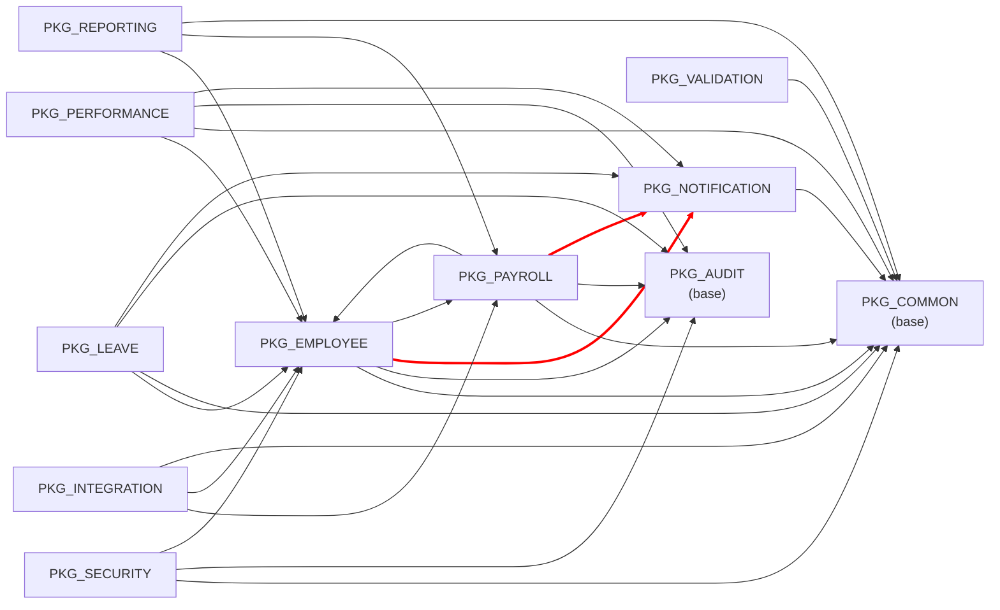

### Circular Dependency Detail

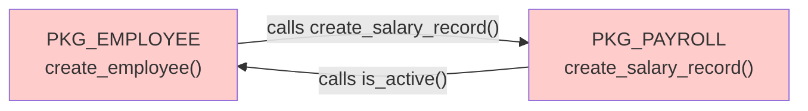

**Resolution in target architecture**: Use Spring Application Events. `EmployeeService` publishes a `NewEmployeeEvent`; `PayrollService` subscribes and creates the salary record asynchronously.

---

## 3. Forms → Package Call Graph

Which Forms modules call which PL/SQL packages.

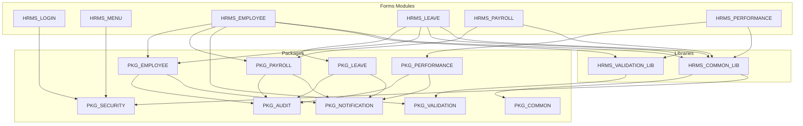

---

## 4. Database Table Relationships (ERD)

Domain-grouped entity relationships.

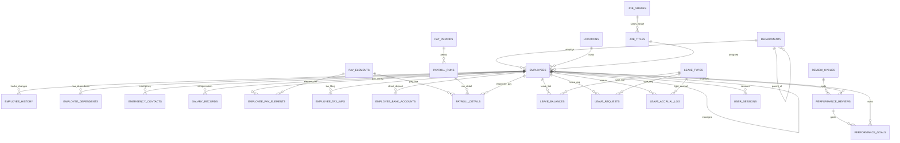

---

## 5. Batch Job / Scheduler Flow

All `DBMS_SCHEDULER`-triggered batch processes and their timing.

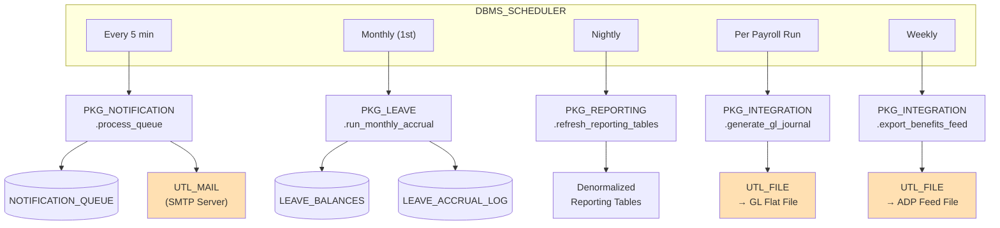

---

## 6. External Integration Data Flow

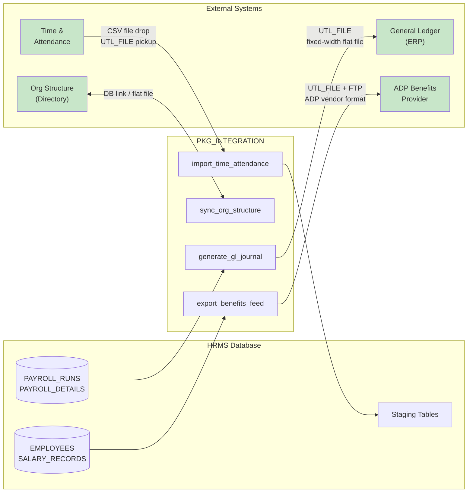

---

## 7. User Authentication & Session Flow

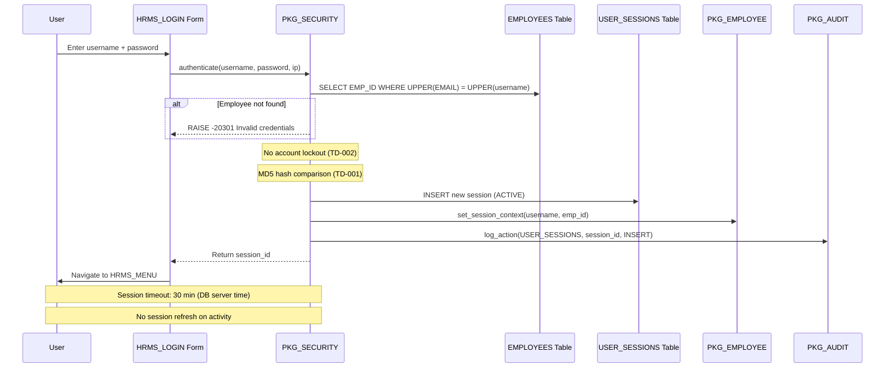

---

## 8. Leave Request Workflow

```mermaid
stateDiagram-v2
    [*] --> PENDING : submit_leave_request()
    PENDING --> APPROVED : approve_leave_request()
    PENDING --> REJECTED : reject_leave_request()
    PENDING --> CANCELLED : cancel_leave_request()
    APPROVED --> CANCELLED : cancel_leave_request()
    APPROVED --> TAKEN : (date passes)

    state PENDING {
        note right of PENDING
            - Validates employee active
            - Checks leave type & tenure
            - Calculates business days
            - Checks overlap (BUG: ignores half-day)
            - Checks balance
            - Updates PENDING in LEAVE_BALANCES
            - Notifies manager
        end note
    }

    state APPROVED {
        note right of APPROVED
            - Moves PENDING → USED in balance
            - Notifies employee
        end note
    }

    state CANCELLED {
        note right of CANCELLED
            - Restores balance (PENDING or USED)
        end note
    }
```

---

## 9. Payroll Processing Pipeline

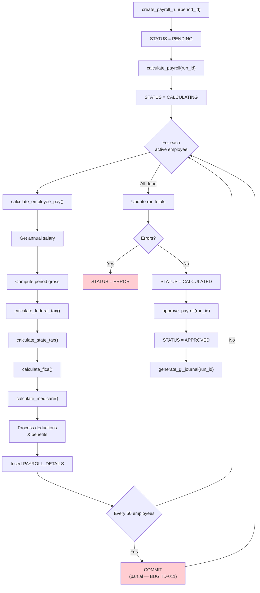

---

## 10. Module Migration Order (Strangler Fig)

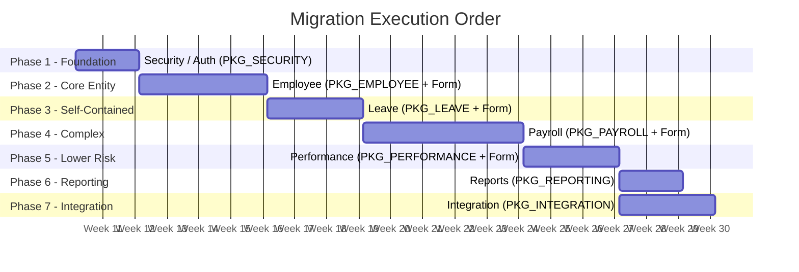

### Dependency Chain Rationale

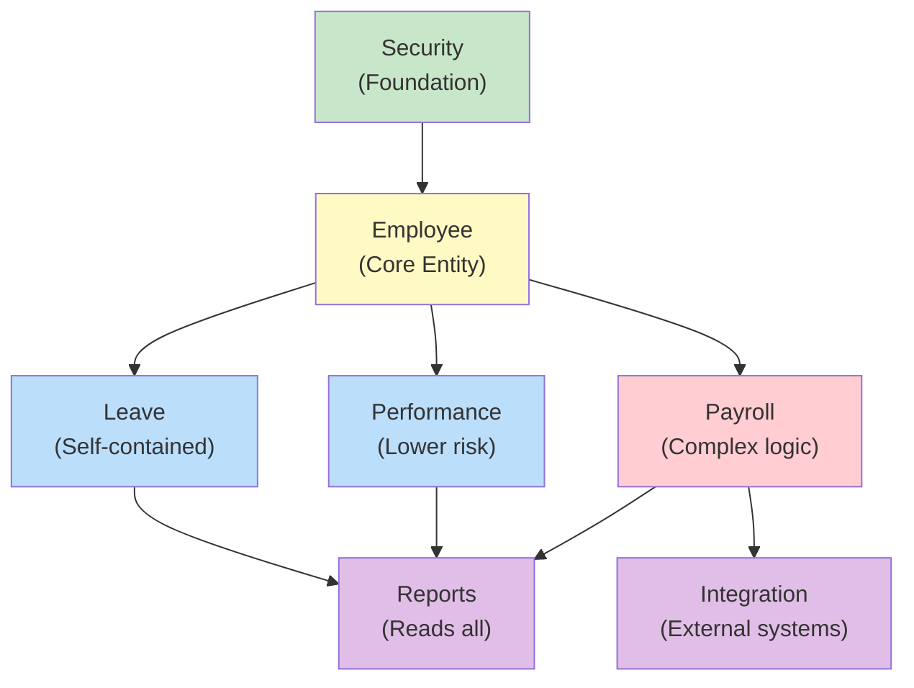

| Color | Meaning |
|---|---|
| Green | Foundation — no upstream dependencies |
| Yellow | Core entity — most other modules depend on this |
| Blue | Medium complexity — can migrate in parallel after Employee |
| Red | Highest complexity — payroll has the most business logic and bugs |
| Purple | Support modules — migrate last, read from all others |
