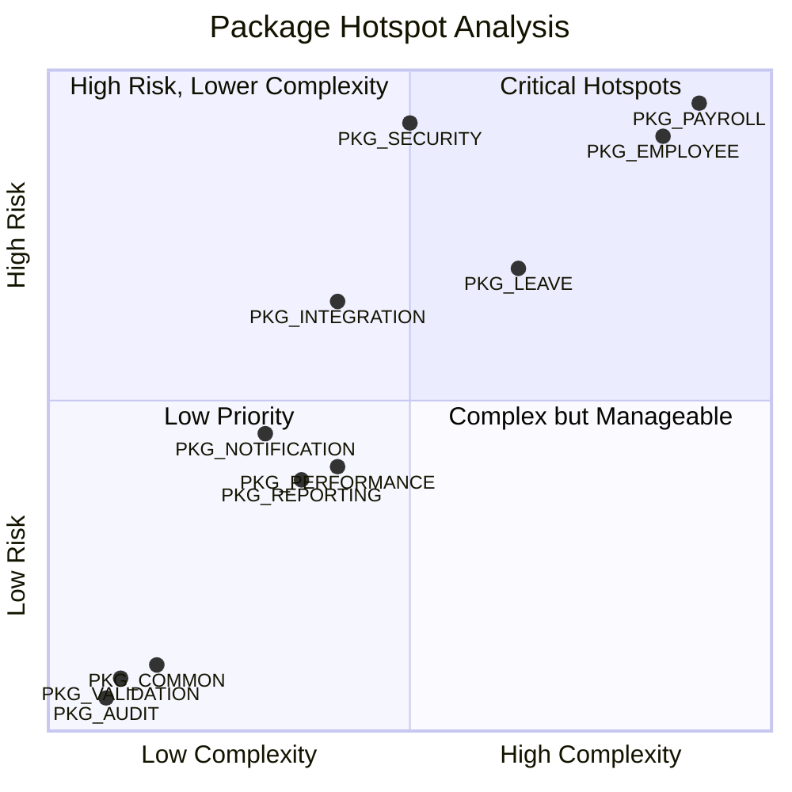
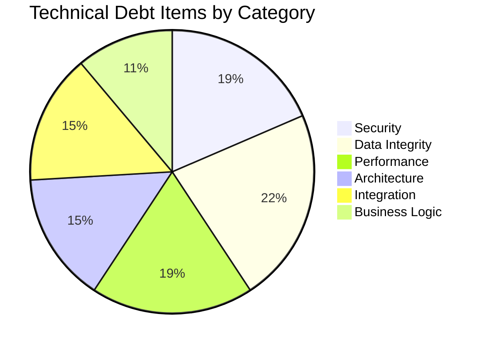
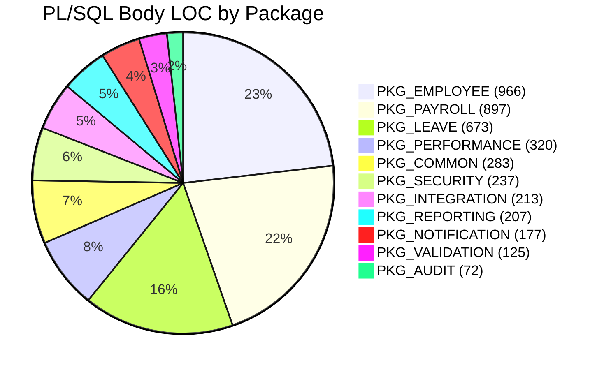
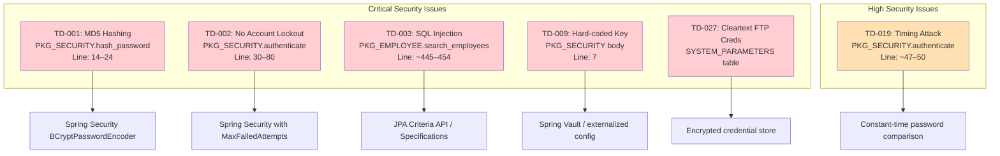
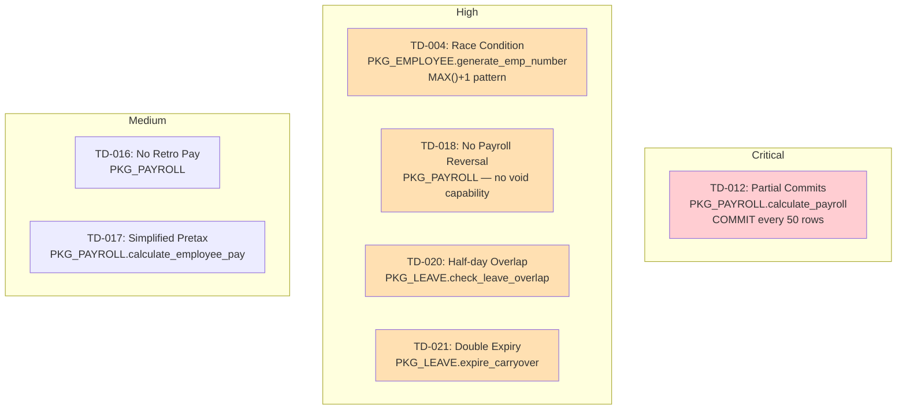
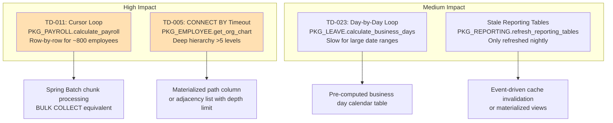
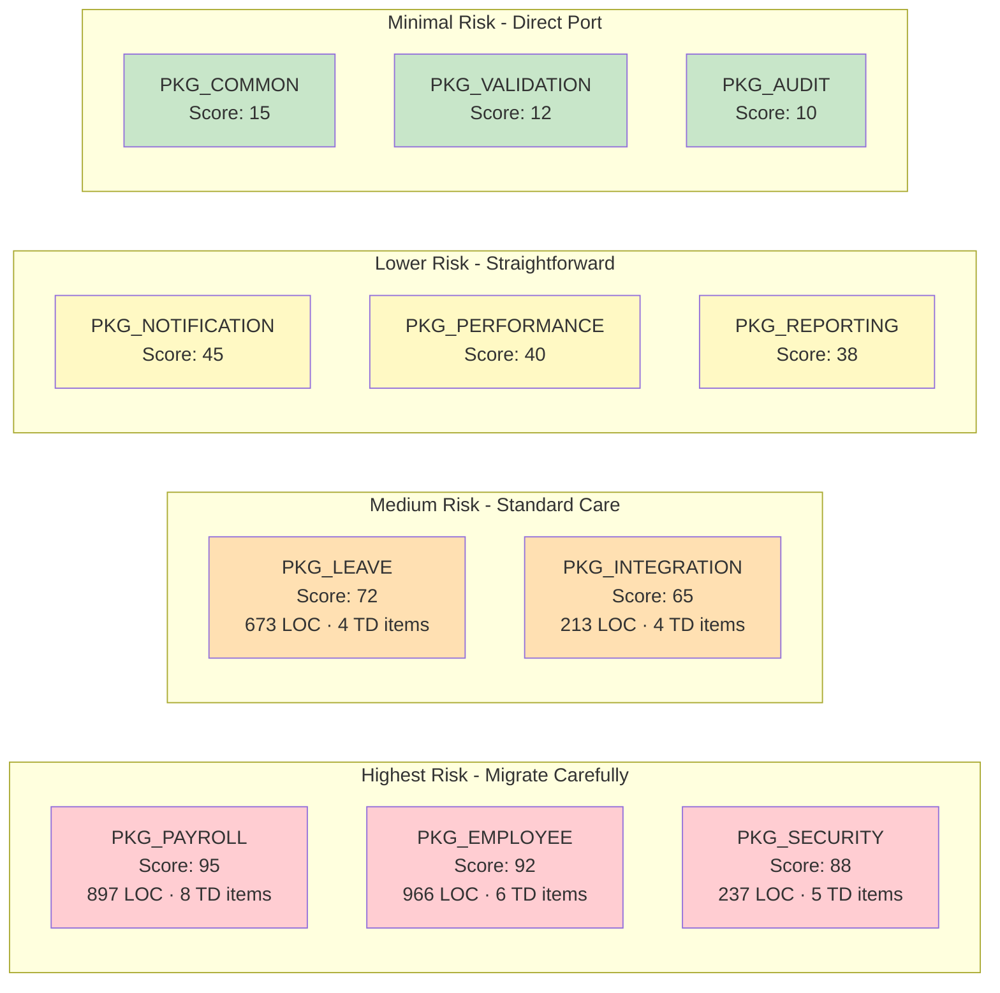
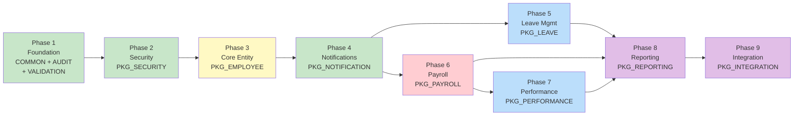

# Hotspot Report — Oracle Forms HRMS

> **Purpose**: Identify high-risk, high-complexity areas in the legacy codebase that require the most care during migration to Java Spring Boot.
> **Methodology**: Each program unit is scored on three axes — **Complexity**, **Risk**, and **Lines of Code** — and cross-referenced with the technical debt catalog (TD-001 through TD-027 in `assessment-report.md`).

---

## Table of Contents

1. [Hotspot Summary Heatmap](#1-hotspot-summary-heatmap)
2. [Package-Level Analysis](#2-package-level-analysis)
3. [Hotspot Visualization](#3-hotspot-visualization)
4. [Technical Debt Cross-Reference](#4-technical-debt-cross-reference)
5. [Security Hotspots](#5-security-hotspots)
6. [Data Integrity Hotspots](#6-data-integrity-hotspots)
7. [Performance Hotspots](#7-performance-hotspots)
8. [Migration Risk Matrix](#8-migration-risk-matrix)
9. [Recommended Migration Priority](#9-recommended-migration-priority)

---

## 1. Hotspot Summary Heatmap

| Package | LOC (Body) | Complexity | Risk | Bugs / TD Items | Hotspot Score |
|---|---|---|---|---|---|
| **PKG_PAYROLL** | 897 | 🔴 Very High | 🔴 Critical | 8 | **95** |
| **PKG_EMPLOYEE** | 966 | 🔴 Very High | 🔴 Critical | 6 | **92** |
| **PKG_SECURITY** | 237 | 🟡 Medium | 🔴 Critical | 5 | **88** |
| **PKG_LEAVE** | 673 | 🟠 High | 🟠 High | 4 | **72** |
| **PKG_INTEGRATION** | 213 | 🟡 Medium | 🟠 High | 4 | **65** |
| **PKG_NOTIFICATION** | 177 | 🟢 Low | 🟡 Medium | 3 | **45** |
| **PKG_PERFORMANCE** | 320 | 🟡 Medium | 🟡 Medium | 1 | **40** |
| **PKG_REPORTING** | 207 | 🟡 Medium | 🟡 Medium | 2 | **38** |
| **PKG_COMMON** | 283 | 🟢 Low | 🟢 Low | 0 | **15** |
| **PKG_VALIDATION** | 125 | 🟢 Low | 🟢 Low | 0 | **12** |
| **PKG_AUDIT** | 72 | 🟢 Low | 🟢 Low | 0 | **10** |

> **Hotspot Score** = `(Complexity × 0.3) + (Risk × 0.4) + (TD_Count × 10 × 0.3)`, normalized to 0–100.

---

## 2. Package-Level Analysis

### 2.1 PKG_PAYROLL — Hotspot Score: 95

| Metric | Value |
|---|---|
| **Spec LOC** | 164 |
| **Body LOC** | 897 |
| **Total LOC** | 1,061 |
| **Public Procedures** | 12 |
| **Estimated Cyclomatic Complexity** | 45–55 (calculate_payroll ~15, calculate_employee_pay ~12, calculate_federal_tax ~8, calculate_state_tax ~6) |
| **Dependencies** | PKG_EMPLOYEE, PKG_COMMON, PKG_AUDIT, PKG_NOTIFICATION |
| **Circular Dependencies** | PKG_EMPLOYEE ↔ PKG_PAYROLL |

**Procedure Breakdown**:

| Procedure/Function | LOC | Complexity | Key Issues |
|---|---|---|---|
| `calculate_payroll` | ~75 | High (15) | Row-by-row cursor loop; partial COMMIT every 50 rows; WHEN OTHERS swallows errors |
| `calculate_employee_pay` | ~180 | Very High (12) | 15+ local variables; tax calc pipeline; simplified pretax deduction logic |
| `calculate_federal_tax` | ~90 | High (8) | Bracket lookup with nested IF/ELSIF; hard-coded 2024 tax constants |
| `calculate_state_tax` | ~70 | High (6) | State-specific branching; only 3 states implemented |
| `calculate_fica` | ~40 | Medium (4) | YTD wage base comparison |
| `calculate_medicare` | ~35 | Medium (3) | Additional Medicare threshold check |
| `create_salary_record` | ~30 | Low (2) | End-dates current record; inserts new |
| `get_current_salary` | ~20 | Low (1) | Simple SELECT with exception |
| `get_salary_as_of` | ~20 | Low (1) | Date-bounded salary query |
| `create_pay_periods` | ~65 | Medium (5) | Monthly/biweekly generation loops |
| `close_pay_period` | ~22 | Low (2) | Status validation and update |
| `get_current_period` | ~15 | Low (1) | Simple date lookup |
| `create_payroll_run` | ~30 | Low (2) | Period status validation |
| `approve_payroll` | ~25 | Low (2) | Status transition |
| `get_ytd_earnings` | ~20 | Low (1) | Aggregate query |

**Technical Debt Items**:
- TD-011: Row-by-row cursor processing (should be BULK COLLECT + FORALL)
- TD-012: Partial commits every 50 employees — failure leaves payroll half-calculated
- TD-013: Hard-coded 2024 tax brackets as package constants
- TD-014: Overtime calculation misses holidays in VW_ACTIVE_EMPLOYEES
- TD-015: State tax only implemented for 3 states
- TD-016: No support for retroactive pay adjustments
- TD-017: calculate_employee_pay simplified pretax deduction handling
- TD-018: No payroll reversal/void capability

---

### 2.2 PKG_EMPLOYEE — Hotspot Score: 92

| Metric | Value |
|---|---|
| **Spec LOC** | 192 |
| **Body LOC** | 966 |
| **Total LOC** | 1,158 |
| **Public Procedures** | 18 |
| **Estimated Cyclomatic Complexity** | 40–50 (create_employee ~10, search_employees ~8, get_org_chart ~7) |
| **Dependencies** | PKG_COMMON, PKG_AUDIT, PKG_NOTIFICATION, PKG_PAYROLL |
| **Circular Dependencies** | PKG_EMPLOYEE ↔ PKG_PAYROLL |

**Procedure Breakdown**:

| Procedure/Function | LOC | Complexity | Key Issues |
|---|---|---|---|
| `create_employee` | ~120 | Very High (10) | 20+ params; calls PKG_PAYROLL.create_salary_record (circular dep); multiple INSERTs |
| `update_employee` | ~90 | High (8) | Tracks old/new for history; conditional updates |
| `search_employees` | ~70 | High (8) | Dynamic SQL via string concatenation — SQL injection vulnerability |
| `get_org_chart` | ~60 | High (7) | CONNECT BY recursive query; times out for deep hierarchies (>5 levels) |
| `transfer_employee` | ~50 | Medium (5) | Cross-department validation; history record |
| `promote_employee` | ~45 | Medium (4) | Grade validation; salary update; history record |
| `terminate_employee` | ~50 | Medium (5) | Status transition; cascading updates; notification |
| `generate_emp_number` | ~30 | Medium (4) | Race condition — uses MAX()+1 instead of sequence |
| `set_session_context` | ~15 | Low (1) | SYS_CONTEXT initialization |
| `get_employee` | ~25 | Low (1) | Simple fetch by ID |
| `get_direct_reports` | ~20 | Low (1) | Manager lookup |
| `get_employee_by_number` | ~20 | Low (1) | Lookup by business key |
| `is_active` | ~10 | Low (1) | Status check |
| `get_headcount` | ~15 | Low (1) | COUNT query |
| `get_department_employees` | ~15 | Low (1) | Dept filter |
| `update_emergency_contacts` | ~35 | Low (2) | UPSERT pattern |
| `update_dependents` | ~35 | Low (2) | UPSERT pattern |
| `rehire_employee` | ~45 | Medium (4) | Status transition; validation |

**Technical Debt Items**:
- TD-003: SQL injection in `search_employees` (dynamic SQL via concatenation)
- TD-004: Race condition in `generate_emp_number` (MAX+1 instead of sequence)
- TD-005: `get_org_chart` CONNECT BY times out for deep hierarchies
- TD-006: SSN stored in EMPLOYEES table (encrypted but should be in separate secure table)
- TD-007: PHOTO_BLOB stored in EMPLOYEES table (should use file storage)
- TD-008: Circular dependency with PKG_PAYROLL

---

### 2.3 PKG_SECURITY — Hotspot Score: 88

| Metric | Value |
|---|---|
| **Spec LOC** | 63 |
| **Body LOC** | 237 |
| **Total LOC** | 300 |
| **Public Procedures** | 8 |
| **Estimated Cyclomatic Complexity** | 15–20 (authenticate ~6, has_permission ~5) |
| **Dependencies** | PKG_COMMON, PKG_AUDIT, PKG_EMPLOYEE |

**Procedure Breakdown**:

| Procedure/Function | LOC | Complexity | Key Issues |
|---|---|---|---|
| `authenticate` | ~50 | Medium (6) | Timing attack; no lockout; TOO_MANY_ROWS fallback to MIN() |
| `has_permission` | ~40 | Medium (5) | Hard-coded grade-based permission model; no RBAC table |
| `hash_password` | ~10 | Low (1) | Uses DBMS_CRYPTO.HASH_MD5 — weak algorithm |
| `encrypt_ssn` | ~12 | Low (1) | Uses hard-coded key in source code |
| `decrypt_ssn` | ~15 | Low (2) | WHEN OTHERS returns '***DECRYPT_ERROR***' |
| `change_password` | ~20 | Low (2) | Basic complexity check; stub — no actual DB update |
| `is_session_valid` | ~25 | Low (3) | 30-min timeout based on DB server time |
| `logout` | ~8 | Low (1) | Simple status update |

**Technical Debt Items**:
- TD-001: MD5 password hashing (must migrate to bcrypt/scrypt)
- TD-002: No account lockout after failed login attempts
- TD-009: Hard-coded AES-256 encryption key in source code (`c_encryption_key`)
- TD-010: Session timeout uses DB server time, not app server time
- TD-019: Timing attack on authenticate (different code paths for invalid user vs invalid password)

---

### 2.4 PKG_LEAVE — Hotspot Score: 72

| Metric | Value |
|---|---|
| **Spec LOC** | 128 |
| **Body LOC** | 673 |
| **Total LOC** | 801 |
| **Public Procedures** | 13 |
| **Estimated Cyclomatic Complexity** | 25–30 (submit_leave_request ~8, run_monthly_accrual ~7) |
| **Dependencies** | PKG_EMPLOYEE, PKG_COMMON, PKG_AUDIT, PKG_NOTIFICATION |

**Procedure Breakdown**:

| Procedure/Function | LOC | Complexity | Key Issues |
|---|---|---|---|
| `submit_leave_request` | ~140 | High (8) | Validation chain: employee, leave type, tenure, dates, overlap, balance |
| `run_monthly_accrual` | ~120 | High (7) | Nested cursor loops (employee × leave type); max balance check |
| `approve_leave_request` | ~50 | Medium (3) | FOR UPDATE lock; balance move from pending to used |
| `reject_leave_request` | ~45 | Medium (3) | Balance restoration |
| `cancel_leave_request` | ~45 | Medium (4) | Different restore logic for PENDING vs APPROVED |
| `calculate_business_days` | ~25 | Medium (4) | Day-by-day loop checking weekends + holidays |
| `process_carryover` | ~60 | Medium (5) | Year-end balance carryover with caps |
| `expire_carryover` | ~40 | Low (3) | Expiry date check — double-expires if run twice |
| `get_leave_balance` | ~20 | Low (1) | Balance formula query |
| `adjust_leave_balance` | ~30 | Low (2) | Update with auto-initialize |
| `initialize_balances` | ~20 | Low (2) | DUP_VAL_ON_INDEX safe insert |
| `check_leave_overlap` | ~15 | Low (1) | Date range overlap check |
| `get_pending_requests` | ~10 | Low (1) | Cursor query |

**Technical Debt Items**:
- TD-020: Half-day overlap detection ignores half-day requests (AM/PM not checked)
- TD-021: `expire_carryover` double-subtracts if run twice on same day
- TD-022: Holiday detection only checks exact date match, not observed dates
- TD-023: `calculate_business_days` uses day-by-day loop (slow for large ranges)

---

### 2.5 PKG_INTEGRATION — Hotspot Score: 65

| Metric | Value |
|---|---|
| **Spec LOC** | 50 |
| **Body LOC** | 213 |
| **Total LOC** | 263 |
| **Public Procedures** | 5 |
| **Estimated Cyclomatic Complexity** | 12–15 |
| **Dependencies** | PKG_COMMON, PKG_PAYROLL, PKG_EMPLOYEE |

**Technical Debt Items**:
- TD-024: GL posting uses UTL_FILE flat file instead of API
- TD-025: Benefits feed is ADP vendor-specific format
- TD-026: No retry logic for failed file transfers
- TD-027: FTP credentials stored as cleartext in SYSTEM_PARAMETERS

---

### 2.6 PKG_NOTIFICATION — Hotspot Score: 45

| Metric | Value |
|---|---|
| **Spec LOC** | 42 |
| **Body LOC** | 177 |
| **Total LOC** | 219 |
| **Public Procedures** | 4 |
| **Estimated Cyclomatic Complexity** | 8–10 |
| **Dependencies** | PKG_COMMON |

**Known Issues**:
- UTL_MAIL configuration hard-coded to legacy SMTP server
- No rate limiting on notification sends
- HTML email templates stored as string constants

---

### 2.7 PKG_PERFORMANCE — Hotspot Score: 40

| Metric | Value |
|---|---|
| **Spec LOC** | 97 |
| **Body LOC** | 320 |
| **Total LOC** | 417 |
| **Public Procedures** | 11 |
| **Estimated Cyclomatic Complexity** | 12–15 |
| **Dependencies** | PKG_EMPLOYEE, PKG_COMMON, PKG_AUDIT, PKG_NOTIFICATION |

Relatively clean module. Main complexity is in `generate_reviews_for_cycle` (bulk creation) and `get_rating_distribution`.

---

### 2.8 PKG_REPORTING — Hotspot Score: 38

| Metric | Value |
|---|---|
| **Spec LOC** | 63 |
| **Body LOC** | 207 |
| **Total LOC** | 270 |
| **Public Procedures** | 8 |
| **Estimated Cyclomatic Complexity** | 10–12 |
| **Dependencies** | PKG_EMPLOYEE, PKG_PAYROLL, PKG_COMMON |

**Known Issues**:
- Denormalized reporting tables only refreshed nightly — stale during business hours
- Some reports use hard-coded fiscal year start (October 1)

---

### 2.9–2.11 Low-Risk Packages

| Package | LOC | Complexity | Notes |
|---|---|---|---|
| PKG_COMMON (404) | 283 body | Low | Base utility — no bugs identified |
| PKG_VALIDATION (172) | 125 body | Low | Pure functions — easy to migrate |
| PKG_AUDIT (104) | 72 body | Low | Simple INSERT-based logging |

---

## 3. Hotspot Visualization

### 3.1 Bubble Chart — LOC vs Complexity vs Risk

### 3.2 Technical Debt Distribution by Category

### 3.3 LOC Distribution Across Packages

---

## 4. Technical Debt Cross-Reference

Complete mapping of all technical debt items from `assessment-report.md` to hotspot analysis.

| TD ID | Package | Category | Severity | Description | Migration Impact |
|---|---|---|---|---|---|
| TD-001 | PKG_SECURITY | Security | 🔴 Critical | MD5 password hashing | Replace with BCrypt via Spring Security |
| TD-002 | PKG_SECURITY | Security | 🔴 Critical | No account lockout | Implement with Spring Security lockout policy |
| TD-003 | PKG_EMPLOYEE | Security | 🔴 Critical | SQL injection in search_employees | Use Spring Data JPA Specifications / Criteria API |
| TD-004 | PKG_EMPLOYEE | Data Integrity | 🟠 High | Race condition in generate_emp_number (MAX+1) | Use database sequence + @GeneratedValue |
| TD-005 | PKG_EMPLOYEE | Performance | 🟠 High | get_org_chart CONNECT BY timeout | Use recursive CTE with depth limit or materialized path |
| TD-006 | PKG_EMPLOYEE | Architecture | 🟡 Medium | SSN in EMPLOYEES table | Separate secure table with field-level encryption |
| TD-007 | PKG_EMPLOYEE | Architecture | 🟡 Medium | PHOTO_BLOB in EMPLOYEES | Use S3/MinIO file storage service |
| TD-008 | PKG_EMPLOYEE / PKG_PAYROLL | Architecture | 🟠 High | Circular dependency | Spring Application Events for async decoupling |
| TD-009 | PKG_SECURITY | Security | 🔴 Critical | Hard-coded encryption key | Use Spring Vault or env-based key management |
| TD-010 | PKG_SECURITY | Architecture | 🟡 Medium | Session timeout uses DB time | JWT with configurable expiry |
| TD-011 | PKG_PAYROLL | Performance | 🟠 High | Row-by-row cursor loop | Spring Batch with chunk-oriented processing |
| TD-012 | PKG_PAYROLL | Data Integrity | 🔴 Critical | Partial commits every 50 rows | Transactional boundaries via @Transactional |
| TD-013 | PKG_PAYROLL | Business Logic | 🟠 High | Hard-coded 2024 tax brackets | Configuration table + admin UI |
| TD-014 | PKG_PAYROLL | Business Logic | 🟡 Medium | Overtime misses holidays | Integrate with holiday calendar service |
| TD-015 | PKG_PAYROLL | Business Logic | 🟡 Medium | State tax only 3 states | Tax calculation service with pluggable state modules |
| TD-016 | PKG_PAYROLL | Data Integrity | 🟡 Medium | No retroactive pay adjustment | Implement adjustment payroll run type |
| TD-017 | PKG_PAYROLL | Data Integrity | 🟡 Medium | Simplified pretax deductions | Full pretax/posttax deduction ordering |
| TD-018 | PKG_PAYROLL | Data Integrity | 🟠 High | No payroll reversal/void | Implement reversal run type with offsetting entries |
| TD-019 | PKG_SECURITY | Security | 🟠 High | Timing attack on authenticate | Constant-time comparison in Spring Security |
| TD-020 | PKG_LEAVE | Data Integrity | 🟠 High | Half-day overlap not checked | Include AM/PM in overlap query |
| TD-021 | PKG_LEAVE | Data Integrity | 🟠 High | expire_carryover double-subtracts | Idempotency check (processed flag) |
| TD-022 | PKG_LEAVE | Business Logic | 🟡 Medium | Holiday observed dates not handled | Observed date calculation logic |
| TD-023 | PKG_LEAVE | Performance | 🟡 Medium | Business days loop slow | Set-based calculation or lookup table |
| TD-024 | PKG_INTEGRATION | Integration | 🟠 High | GL via flat file | REST/SOAP API integration |
| TD-025 | PKG_INTEGRATION | Integration | 🟡 Medium | ADP vendor-specific format | Abstraction layer with pluggable format adapters |
| TD-026 | PKG_INTEGRATION | Integration | 🟠 High | No retry logic | Spring Retry with exponential backoff |
| TD-027 | PKG_INTEGRATION | Security | 🔴 Critical | FTP creds in cleartext | Encrypted credentials in Vault / env config |

---

## 5. Security Hotspots

---

## 6. Data Integrity Hotspots

---

## 7. Performance Hotspots

---

## 8. Migration Risk Matrix

---

## 9. Recommended Migration Priority

Based on the Strangler Fig pattern, hotspot scores, and dependency analysis:

| Priority | Package | Rationale | Estimated Effort |
|---|---|---|---|
| **1** | PKG_COMMON, PKG_AUDIT, PKG_VALIDATION | Foundation with zero bugs; all other packages depend on these | 1 week |
| **2** | PKG_SECURITY | Critical security fixes (MD5, lockout, hard-coded key); gates all other modules | 2 weeks |
| **3** | PKG_EMPLOYEE | Core entity; most modules depend on employee data; resolve circular dep | 4 weeks |
| **4** | PKG_NOTIFICATION | Shared service; simple but used by 4 business packages | 1 week |
| **5** | PKG_LEAVE | Self-contained domain; 4 bugs to fix but well-isolated | 3 weeks |
| **6** | PKG_PAYROLL | Highest complexity; migrate after Employee to break circular dep | 5 weeks |
| **7** | PKG_PERFORMANCE | Lower risk; depends only on Employee | 3 weeks |
| **8** | PKG_REPORTING | Read-only; can run against old or new schema during transition | 2 weeks |
| **9** | PKG_INTEGRATION | External system coupling; migrate last to minimize disruption | 3 weeks |

### Migration Flow

